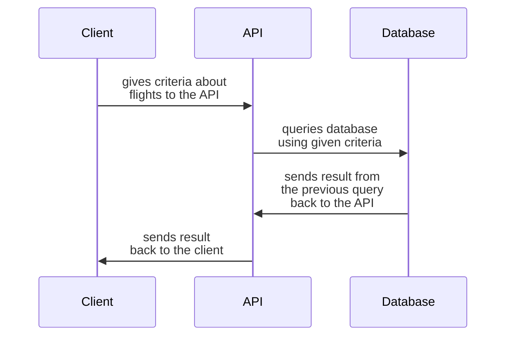
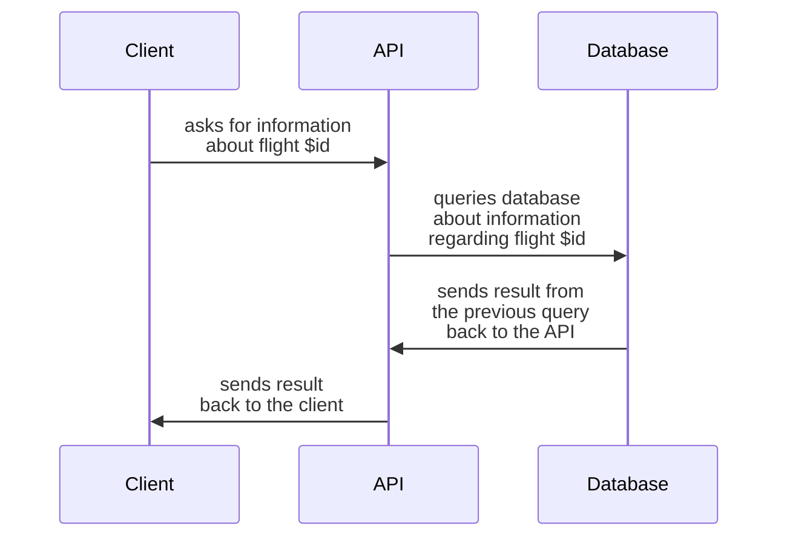
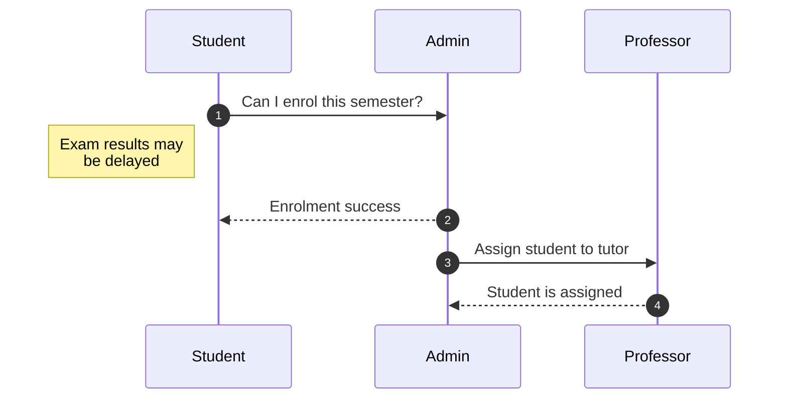

# Dataset: [Flight Data](https://www.kaggle.com/datasets/robikscube/flight-delay-dataset-20182022?select=Combined_Flights_2022.csv)

# What do we want to serve (Value + API):

### **Use cases:**

The template for use case requests and responses is as follows:
```rust
{
	 acronym: type = "description",
	*acronym: type = "description" // in the case of required args
}
```
**Note:** This template is complete adlib. If there is a standard way for doing it, please inform us so we can alter it accordingly.

### **Use Case 1:** 

User will obtain data regarding flights

- **Endpoint:** `/flights`

- **REST Type:** `GET`

- **Request Parameters:**
```json
{
  "limit": "integer",
  "only-statistics": "boolean",
  "airline-code":"string",
  "origin-airport-id":"integer",
  "dest-airport-id":"integer",
  "start-date":"date",
  "end-date":"date"
}
```

- **Response Parameters:**
```json
{
  "statistics": {
    "total_flights": "integer",
    "average_delay": "integer",
    "max_delay": "integer",
    "cancellation_percentage": "integer",
    "diversion_percentage": "integer"
  },
  "flights": [
    {
      "flightDate": "date",
      "flightNumber": "integer",
      "flightDuration": "integer",
      "cancelled": true,
      "diverted": true,
      "airline": {
        "name": "string",
        "iata": "string",
        "icao": "string"
      },
      "departure": {
        "airport": {
          "name": "string",
          "iata": "string",
          "icao": "string"
        },
        "scheduled": "integer",
        "actual": "integer",
        "delay": "integer"
      },
      "arrival": {
        "airport": {
          "name": "string",
          "iata": "string",
          "icao": "string"
        },
        "scheduled": "integer",
        "actual": "integer",
        "delay": "integer"
      },
      "tailNumber": "string"
    }
  ]
}
```

- **Use Case Diagram:**


### **Use Case 2:** 

User will obtain flight data by flight number

- **Endpoint:** `/flights/:flight-number`

- **REST Type:** `GET`

- **Request Parameters:**
```json
{
  *"flight-number": integer
}
```

- **Response Parameters:**
```json
{
  "flightDate": "date",
  "flightNumber": "integer",
  "flightDuration": "integer",
  "cancelled": true,
  "diverted": true,
  "airline": {
    "name": "string",
    "iata": "string",
    "icao": "string"
  },
  "departure": {
    "airport": {
      "name": "string",
      "iata": "string",
      "icao": "string"
    },
    "scheduled": "integer",
    "actual": "integer",
    "delay": "integer"
  },
  "arrival": {
    "airport": {
      "name": "string",
      "iata": "string",
      "icao": "string"
    },
    "scheduled": "integer",
    "actual": "integer",
    "delay": "integer"
  },
  "tailNumber": "string"
}
```

- **Use Case Diagram:**


### **Use Case 3:** 

User will obtain a forecast for a future flight

- **Endpoint:** `/flights/forecast`

- **REST Type:** `GET`

- **Request Parameters:**
```json
{
 *"flight-date":"string",
  "airline-code":"string",
  "origin-airport-id":"integer",
  "dest-airport-id":"integer",
  "departure-time":"integer",
  "arrival-time":"integer"
}
```

- **Response Parameters:**
```json
{
  "cancellingProbability": "integer",
  "divertingProbability": "integer",
  "expectedDelay": "integer",
  "expectedFlightDuration": "integer"
}
```

- **Use Case Diagram:**


### **Use Case 4:** 

User will obtain information about airlines and their reliability

- **Endpoint:** `/airline/rank`

- **REST Type:** `GET`

- **Request Parameters:**
```json
{
  "airline-code": "string",
  "origin-airport-id": "integer",
  "dest-airport-id": "integer",
  "start-date": "date",
  "end-date": "date",
  "cancellation-weight": "integer",
  "diversion-weight": "integer",
  "delay-weight": "integer"
}
```

- **Response Parameters:**
```json
[
  {
    "rankScore": "integer",
    "airline": {
      "name": "string",
      "iata": "string",
      "icao": "string"
    },
    "statistics": {
      "total_flights": "integer",
      "average_delay": "integer",
      "max_delay": "integer",
      "cancellation_percentage": "integer",
      "diversion_percentage": "integer"
    }
  }
]
```

- **Use Case Diagram:**

### **Use Case 5:**

Admin will add the information about a flight to the database

- **Endpoint:** `/admin`
  
- **REST Type:** `POST`
  
- **Request Parameters:**
```json
```
- **Response Parameters:**
```json
```

- **Use Case Diagram:**


### **Use Case 6:**

Admin will update the information about a flight on the database

- **Endpoint:** `/admin`
  
- **REST Type:** `PUT`
  
- **Request Parameters:**
```json
```
- **Response Parameters:**
```json
```

- **Use Case Diagram:**

### **Use Case 7:**

Admin will delete the information about a flight from the database

- **Endpoint:** `/admin`
  
- **REST Type:** `DELETE`
  
- **Request Parameters:**
```json
```
- **Response Parameters:**
```json
```

- **Use Case Diagram:**

#### Use Case Diagram example:


