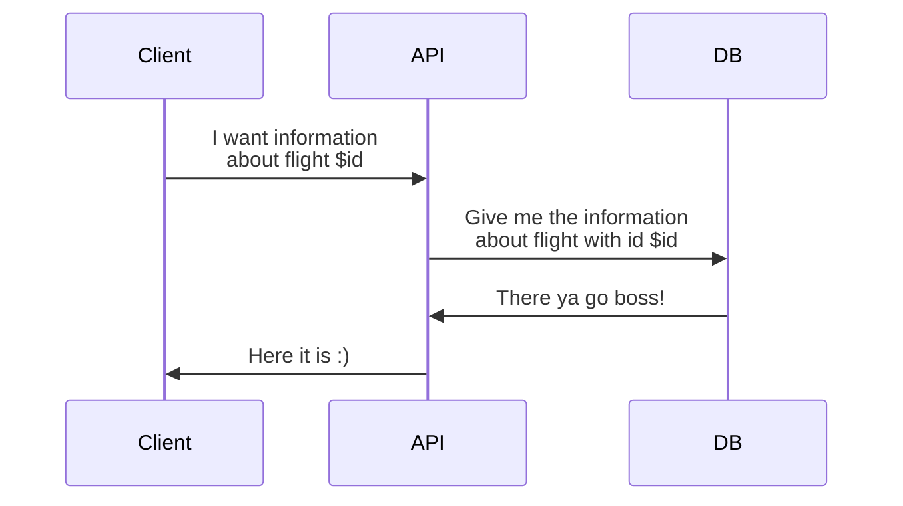
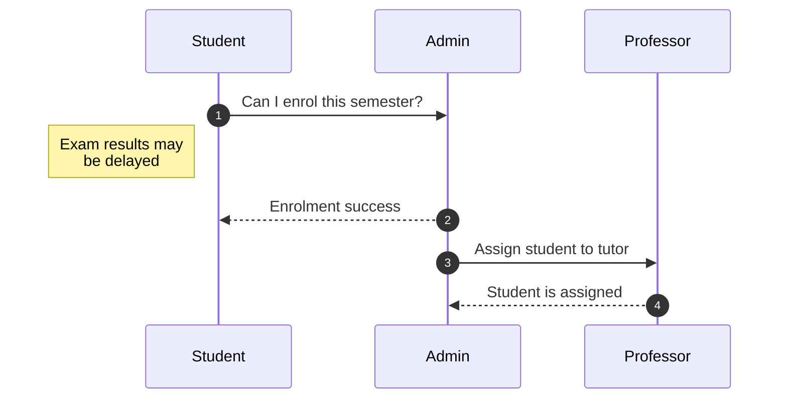

# Dataset:
[Flight Data](https://www.kaggle.com/datasets/robikscube/flight-delay-dataset-20182022?select=Combined_Flights_2022.csv)

# What do we want to serve (Value + API):

## Use cases:

The use case request and response templates are not final and at the time are in the form of:
```rust
{
	 acronim: type = "description",
	*acronim: type = "description" // in the case of optional args
}
```
Using the "\*" to denote if an argument is optional free's up the "?" to ask questions among ourselves
This template is complete adlib and if there is a standard way of doing this please tell


### Use Case 1:

User will get general information about a flight in the dataset

- Endpoint: `/flights/:id`
- REST Type: GET
- Request parameters:
```rust
{
	id: number = "id"
}
```
- Response parameters:
```rust
{
	ori: string = "origin",
	dst: string = "destination",
	date: (date format?)="date",
	other_info: idk = "",
	...
}
```



### Use Case 2:

User will get reliability scores about airlines.

- Endpoint: `/airline/rank`
- REST Type: GET
- Request params:
```rust
{
	*ori: string = "origin",
	*dst: string = "destination", 
	*limit: int = "idk what this is ?",
	start: (date format?) = "initial date to be considered",
	end: (date format?) = "end date to be considered",
	weights: array of ints = [can_weight, div_weight, del_weight] 
	//*can_weight: int from 0 to 100 = "cancelation weight", 
	//*div_weight: int from 0 to 100 = "diversion weight",
	//*del_weight: int from 0 to 100 = "delay weight",
	// I like the idea of using an array to deal with the problem of
	// requiering that all have to be inputed or none, but i accept
	// other interpretations.
	(any more ?)
}
```
- Response params:
```rust
{
	airlines: [
		{
			name: string = "the name of the airline",
			r_score: float = "reliability score",
			can_per: float = "percentage of cancelations",
			div_per: float = "percentage of diversions",
			del_per: float = "percentage of delays",
			max_del: float = "maximum delay",
			min_del: float = "minimum delay",
			... (more ?)
		},
		...
	]
}
```

### Use Case 3:

User will get general statistics about flights with certain conditions

- Endpoint: `/flights/statistics`
- REST Type: GET
- Request params:
```rust
{
	*airline: string = "possible filter by airline",
	*origin: string = "possible filter by origin",
	*destination: string = "possible filter by destination",
	start: (date format?) = "start date to be queried from",
	end: (date format?) = "end date to be queried to"
}
```
- Response params:
```rust
{
	can_per: float = "percentage of cancelations",
	div_per: float = "percentage of diversions",
	del_per: float = "percentage of delays",
	avg_del: float = "average delay",
	max_del: float = "maximum delay",
	min_del: float = "minimum delay"
	(more ?)
}
```


### Use Case 4:

User will ask the api to predict a future flight

- Endpoint: `/flights/forecast`
- REST Type: GET
- Request params:
```rust
{
	ori: string = "origin",
	dst: string = "destination",
	arl: string = "airline",
	date: (date format?)="date"
}
```
- Response params:
```rust
{
	can_prb: float = "cancelation probability",
	div_prb: float = "diversion probability",
	exp_del: float = "expected delay"
}
```

### Use Case 5:

Admin will update the information about a flight
- Endpoint:
- REST Type: POST (?)
- Request params:
```rust
```
- Response params:
```rust
```

### Use Case 6:

Admin delete the information about a flight

- Endpoint:
- REST Type: DELETE
- Request params:
```rust
```
- Response params:
```rust
```

### Use Case 7:

Admin will add the information about a flight to the db

- Endpoint:
- REST Type: 
- Request params:
```rust
```
- Response params:
```rust
```


#### Use Case Diagram example:


