```mermaid

sequenceDiagram

  Admin->>API Gateway: Provides information about <br> flight to be deleted
	API Gateway->>Flights Microservice: Route request to <br> corresponding microservice
  Flights Microservice->>Databases: Deletes data
	Databases-->>Flights Microservice: Sends status of deletion
  Flights Microservice-->>API Gateway: Sends status of deletion
  API Gateway-->>Admin: Sends resultㅤ

```

# Dataset: [Flight Data](https://www.kaggle.com/datasets/robikscube/flight-delay-dataset-20182022?select=Combined_Flights_2022.csv)

# What do we want to serve (Value + API):

### **Use Case 1:** 

User obtains statistics about flights according to certain criteria.

- **Endpoint:** `/flights/statistics`

- **REST Type:** `GET`

- **Use Case Diagram:**

### **Use Case 2:** 

User obtains flight information by flight number.

- **Endpoint:** `/flights/{:flight-number}`

- **REST Type:** `GET`

- **Use Case Diagram:**

### **Use Case 3:** 

User provides a future flight details and obtains a forecast on the probability of the flight being cancelled, diverted and delayed.

- **Endpoint:** `/flights/forecast`

- **REST Type:** `GET`

- **Use Case Diagram:**

### **Use Case 4:** 

User obtains the ranking of airlines and their reliability

- **Endpoint:** `/airline/rank`

- **REST Type:** `GET`

- **Use Case Diagram:**

### **Use Case 5:**

Admin adds information about a flight to the database.

- **Endpoint:** `/admin/flight`
  
- **REST Type:** `POST`
  
- **Use Case Diagram:**

### **Use Case 6:**

Admin updates the information of a flight on the database by flight number.

- **Endpoint:** `/admin/flight/{:flight-number}`
  
- **Use Case Diagram:**

### **Use Case 7:**

Admin deletes the information of a flight from the database

- **Endpoint:** `/admin/flight/{flight-number}`
  
- **REST Type:** `DELETE`

- **Use Case Diagram:**
